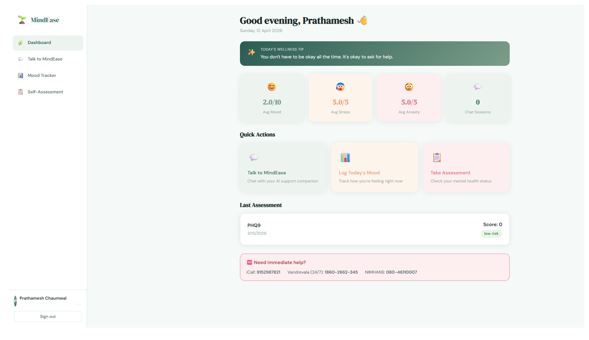
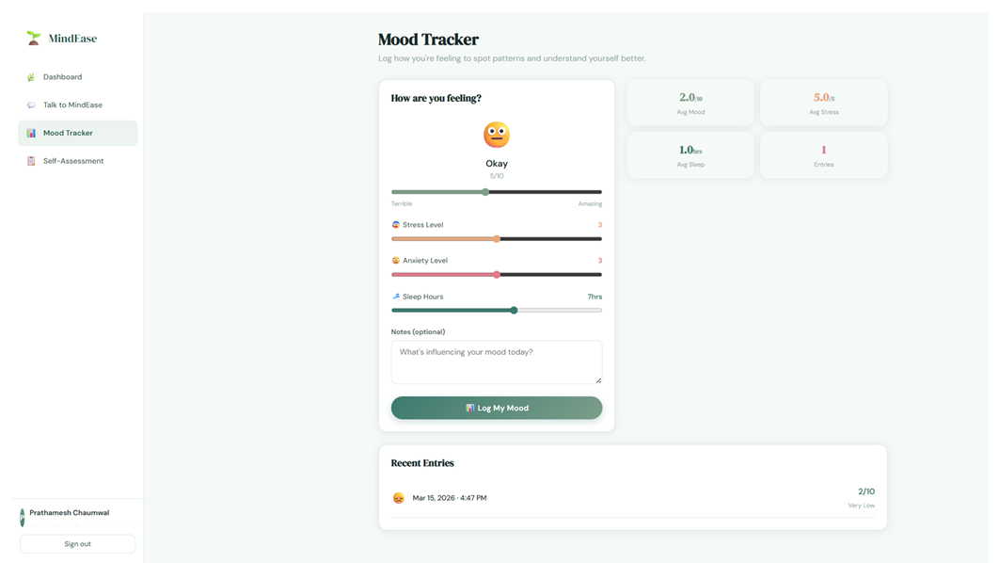
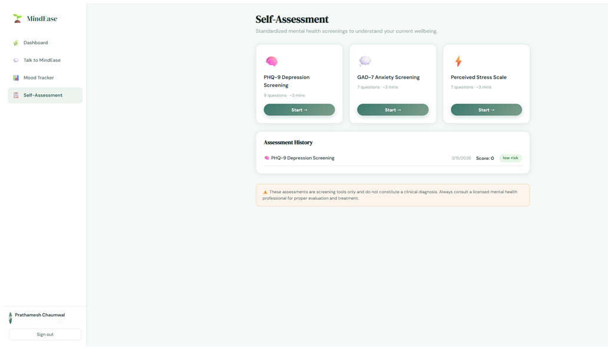

# 🌱 MindEase — AI Mental Health Support Platform

> An AI-powered mental health support platform built for college students - providing emotional support, mood tracking, and self-assessment tools.

---

## 📸 Screenshots

### Login Page
<!-- Add screenshot here -->


### Dashboard
<!-- Add screenshot here -->


### Mood Tracker
<!-- Add screenshot here -->


### Self-Assessment
<!-- Add screenshot here -->


### Settings
<!-- Add screenshot here -->


> **Note:** The AI Chat feature requires a valid API key to run and is not demonstrated in screenshots.

---

## 👨‍💻 Team

| Name | Role |
|------|------|
| **Prathamesh Chaumwal** | Backend — FastAPI, JWT Auth, AI Integration |
| **Parth Chaudhari** | Frontend — React 18, UI/UX |
| **Chandan Choudhary** | Research, Documentation & Frontend Support |
| **Gokul Krishnan A V** | Database — MySQL Schema & Management |

**Guide:** Prof. Komal Rajgude
**Department:** Computer Science Engineering (AI & DS)
**Project Type:** Community Engineering Project

---

## 🏗️ Tech Stack

| Layer      | Technology                        |
|------------|-----------------------------------|
| Frontend   | React 18, React Router, Recharts  |
| Backend    | Python 3.10+, FastAPI             |
| Database   | MySQL 8+                          |
| AI         | Anthropic Claude API (OpenRouter) |
| Auth       | JWT (python-jose + bcrypt)        |

---

## 📁 Project Structure

```
mindease/
├── backend/
│   ├── main.py              # FastAPI app entry point
│   ├── config.py            # Settings from .env
│   ├── database.py          # MySQL connection pool
│   ├── auth.py              # JWT + password hashing
│   ├── dependencies.py      # Auth middleware
│   ├── models.py            # Pydantic schemas
│   ├── ai_service.py        # AI API integration
│   ├── schema.sql           # MySQL table definitions
│   ├── requirements.txt
│   ├── .env.example
│   └── routers/
│       ├── auth_router.py
│       ├── chat_router.py
│       ├── mood_router.py
│       └── assessment_router.py
│
└── frontend/
    ├── package.json
    ├── public/index.html
    └── src/
        ├── App.js
        ├── index.js
        ├── index.css
        ├── api.js
        ├── context/
        │   └── AuthContext.js
        ├── components/
        │   ├── Sidebar.js
        │   └── Topbar.js
        └── pages/
            ├── Login.js
            ├── Register.js
            ├── Dashboard.js
            ├── Chat.js
            ├── MoodTracker.js
            ├── Assessment.js
            ├── Exercises.js
            └── Settings.js
```

---

## ⚡ Setup Instructions

### Prerequisites
- Python 3.10+
- Node.js 18+
- MySQL 8+
- An AI API key (Anthropic or OpenRouter)

---

### Step 1 — MySQL Database

Open PowerShell / Terminal and log into MySQL:

```bash
# Windows (if mysql not in PATH)
& "C:\Program Files\MySQL\MySQL Server 8.0\bin\mysql.exe" -u root -p

# Mac / Linux
mysql -u root -p
```

Once inside the MySQL shell, run:

```sql
source /path/to/mindease/backend/schema.sql
exit
```

---

### Step 2 — Backend Setup

```bash
cd mindease/backend

# Create and activate virtual environment
python -m venv venv

# Windows
venv\Scripts\activate

# Mac / Linux
source venv/bin/activate

# Install dependencies
pip install -r requirements.txt
pip install email-validator
pip install bcrypt==4.0.1

# Create your .env file
copy .env.example .env     # Windows
cp .env.example .env       # Mac/Linux
```

Edit `.env` with your values:

```env
DB_HOST=localhost
DB_PORT=3306
DB_NAME=mindease
DB_USER=root
DB_PASSWORD=YOUR_MYSQL_PASSWORD

JWT_SECRET=any-long-random-string-here

ANTHROPIC_API_KEY=your-api-key-here
```

Start the backend:

```bash
python -m uvicorn main:app --port 8000
```

✅ Backend running at: `http://localhost:8000`
📖 API docs at: `http://localhost:8000/docs`

---

### Step 3 — Frontend Setup

Open a **new terminal window** (keep backend running):

```bash
cd mindease/frontend

npm install
npm start
```

✅ Frontend running at: `http://localhost:3000`

---

## 🔑 Features

### 💬 AI Chat
- Conversational emotional support powered by Claude
- Full chat history saved per session
- Sentiment analysis on user messages
- Crisis helpline info automatically included

> ⚠️ **Note:** The AI chat requires a valid API key set in `.env`. The feature will not work without one.

### 📊 Mood Tracker
- Daily mood logging (1–10 score)
- Stress, anxiety, and sleep tracking
- Visual charts (mood over time, stress/anxiety trends)
- Entry history with notes

### 📋 Self-Assessments
- **PHQ-9** – Depression screening
- **GAD-7** – Anxiety screening
- **PSS** – Perceived Stress Scale
- Automatic risk scoring (Low / Moderate / High)
- Personalised recommendations
- Full assessment history

### 🌬️ Exercises
- Breathing exercises (Box, 4-7-8, 2:1 Calm)
- Animated breathing circle with guided phases
- 5-4-3-2-1 Grounding technique
- Reflective journaling with prompts

### 🔐 Authentication
- Secure registration & login
- JWT tokens with 24h expiry
- bcrypt password hashing
- Protected routes on both frontend and backend

---

## 🆘 Crisis Resources (India)

| Resource | Number |
|----------|--------|
| iCall | 9152987821 |
| Vandrevala Foundation (24/7) | 1860-2662-345 |
| NIMHANS | 080-46110007 |

---

## 📡 API Endpoints

| Method | Endpoint | Description |
|--------|----------|-------------|
| POST | `/auth/register` | Create account |
| POST | `/auth/login` | Login & get token |
| POST | `/chat/message` | Send message, get AI reply |
| GET  | `/chat/sessions` | List all chat sessions |
| GET  | `/chat/sessions/{id}/messages` | Get messages in session |
| POST | `/mood/log` | Log mood entry |
| GET  | `/mood/history` | Get mood logs |
| GET  | `/mood/stats` | Get mood statistics |
| POST | `/assessment/submit` | Submit assessment |
| GET  | `/assessment/history` | Get assessment history |

---

## 🧪 Quick Test

1. Open `http://localhost:3000`
2. Click **"Create an account"**
3. Register with your name, email, and password
4. You'll land on the **Dashboard**
5. Try **"Log Today's Mood"** to track your mood
6. Take a **"Self-Assessment"** for a mental health check
7. Try the **Exercises** page for breathing & grounding

> The AI Chat page requires an API key to function.

---

## ⚠️ Disclaimer

MindEase is an academic project providing emotional support tools. It is **not** a substitute for professional mental health care. If you or someone you know is in crisis, please contact a licensed mental health professional immediately.
